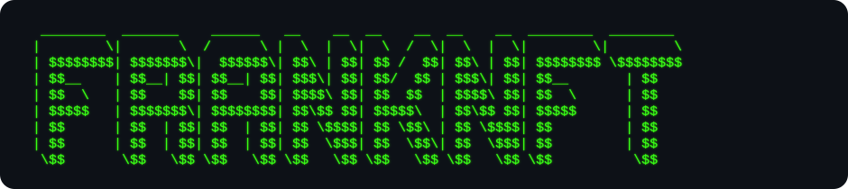

<div align="center">
<div align="center">

</div>
<a href="https://git.io/typing-svg">
  
</a>

</div>

---

## `$ forge install ./stack`

<div align="center">

[](https://www.java.com)
[](https://www.python.org)
[](https://soliditylang.org)
[](https://www.typescriptlang.org)
[](https://swift.org)
[](https://developer.apple.com/library/archive/documentation/Cocoa/Conceptual/ProgrammingWithObjectiveC/Introduction/Introduction.html)
[](https://www.arduino.cc)
[](https://react.dev)
[](https://nextjs.org)
[](https://tailwindcss.com)
[](https://nodejs.org)
[](https://www.docker.com)
[](https://git-scm.com)
[](https://www.linux.org)
[](https://www.postgresql.org)
[](https://developer.apple.com/xcode/)
[](https://www.apple.com/ios/)
[](https://opencode.ai)
[](https://cursor.sh)
[](https://claude.ai)
[]([https://claude.ai](https://developers.openai.com/))
[](https://vercel.com)
[](https://bitbucket.org)

</div>

---

## `$ cat /proc/metrics`

```
identity      FrankNFT.eth
uptime        35+ years in technology
contracts     40+ smart contracts deployed
languages     Java | Solidity | Python | TypeScript | React
systems       aircraft | banking | blockchain | agentic AI
mode          still here. still building.
```

---

## `$ watch ./contribution-graph --live`

<div align="center">


</div>

---

## `$ ping frankponcelet.com`

<div align="center">

[](https://frankponcelet.com)
[](https://x.com/FrankNFT_eth)
[](https://www.linkedin.com/in/frankponcelet)
[](https://opensea.io/FrankNFT_eth)

</div>

---
